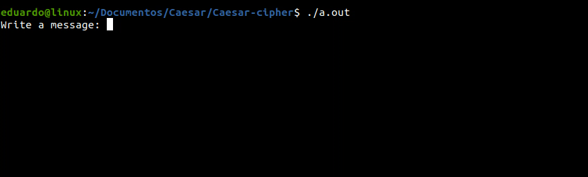

# Caesar Cipher
Simple terminal based algorithm that takes a string and encrypt using the caesar cipher method then save it on Crypto.txt.

    
## Running the code
You need to download the Caesar.c, Crypto.txt files and compile in a compiler of your preference,
If you are using ubuntu you can download the gcc/g++ compiler by putting the following command on terminal and hitting enter:
    
    $ sudo apt install g++
    
or

    $ sudo apt install build-essential
    
after compiling just run it!

# Caesar cracker

download the CaesarCrack.c file to decrypt any caesar cipher encrypted message.
